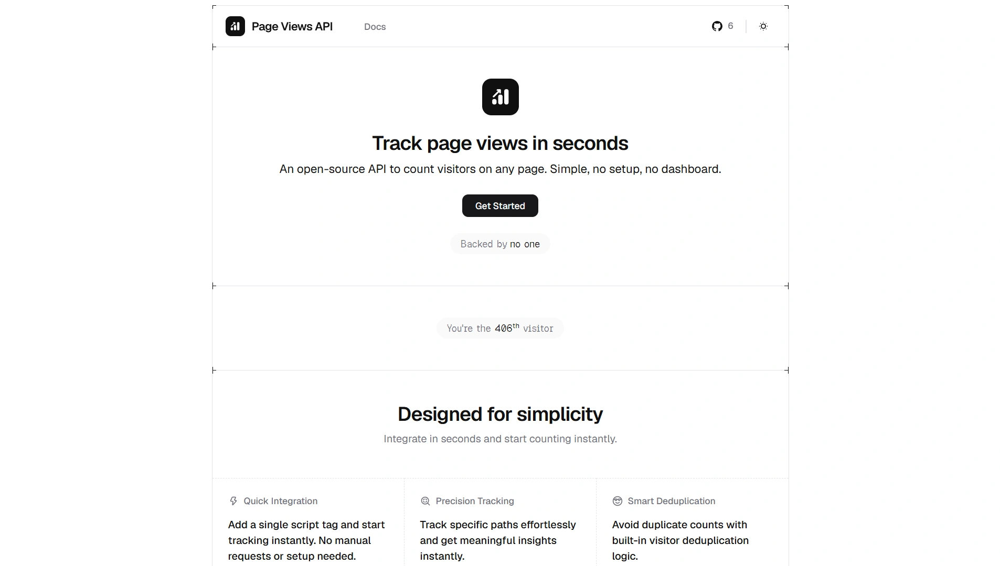

# [Page Views API](https://page-views-api.ratneshc.com) &middot; 

An open-source API to count visitors on any page. Simple, no setup, no dashboard.

- Drop-in script, no setup required
- Track with precision using simple script parameters
- Smart deduplication for accurate counts
- Optimized for speed and reliability

→ Check out the live site: [page-views-api.ratneshc.com](https://page-views-api.ratneshc.com)

<a href="https://page-views-api.ratneshc.com">
  <picture>
    <source media="(prefers-color-scheme: dark)" srcset="./.github/screenshot-dark.webp">
    <source media="(prefers-color-scheme: light)" srcset="./.github/screenshot-light.webp">
    
  </picture>
</a>

## Documentation

Please refer to the [documentation](https://page-views-api.ratneshc.com/docs/getting-started) for API usage and examples.

## Contributing

Please read the [contributing guide](/CONTRIBUTING.md).

## Star History

<picture>
  <source media="(prefers-color-scheme: dark)" srcset="https://repostars.dev/api/embed?repo=ratneshchipre%2Fpage-views-api&theme=dark">
  <source media="(prefers-color-scheme: light)" srcset="https://repostars.dev/api/embed?repo=ratneshchipre%2Fpage-views-api&theme=light">
  
</picture>

## License

This project is licensed under the [MIT license](./LICENSE).
